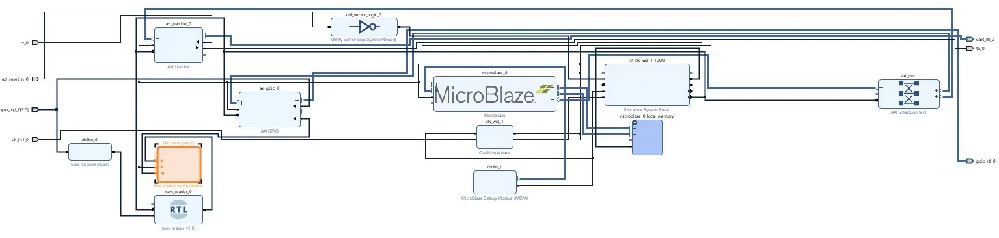
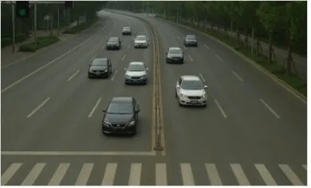
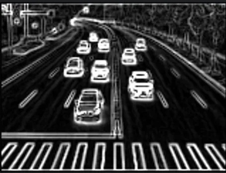
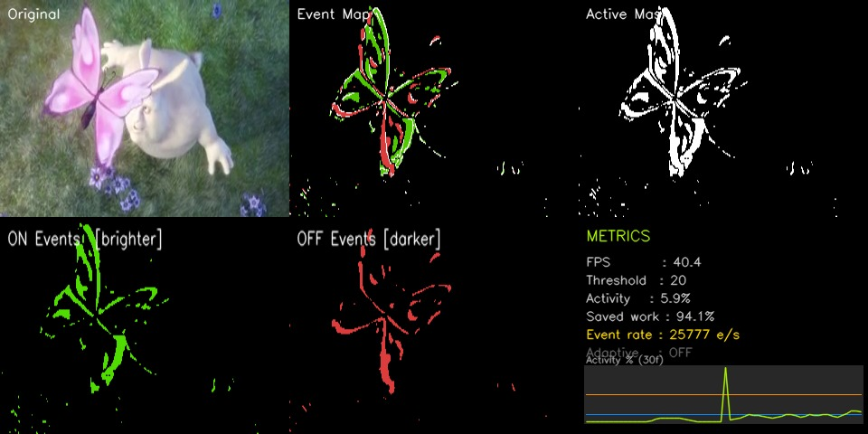
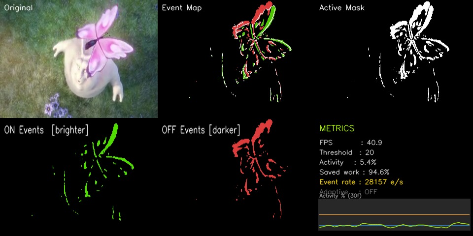
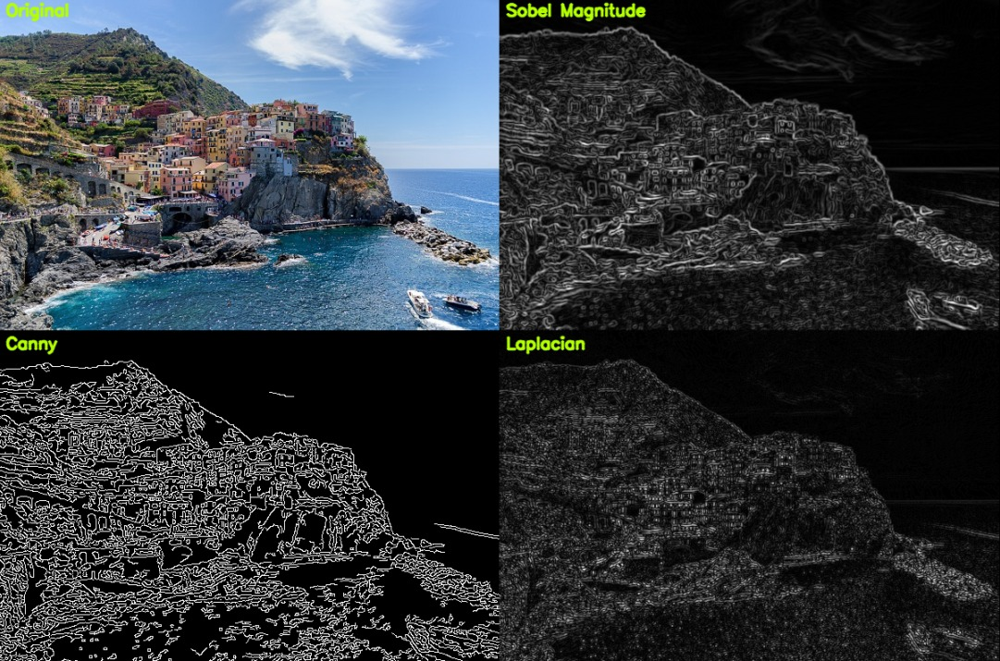

# SKILL LAB PRACTICAL HACKATHON
**Final Project README**
> Project Weight: 100% | Team Size: 2 students | Project Duration: 16 hours | Project Type: Playful, interactive, technology-based experience

---

## Before you begin
Repository forked and renamed as: **SKILLLAB_PROR-2026-EdgeDetectors**

---

## 1. Team Identity

### 1.1 Studio / Group Name
**EdgeDetectors**

### 1.2 Team Members

| Name | Primary Role | Secondary Role | Strengths Brought to the Project |
|---|---|---|---|
| Sahil Singh *(Team Lead)* | Hardware Setup & Integration | Project Coordination | Raspberry Pi setup, peripheral configuration, team management |
| Kartik Nagare | Coding | Testing | Algorithm design, Python, OpenCV, frame processing pipeline |
| Shreyash Garud | Computer Vision | Documentation | Panel layout, display assembly, metrics rendering |
| Kunal Sahasrabudhe | Vivado Testing & Debugging | Coding Support | Live testing on FPGA, debugging, adaptive threshold validation |

### 1.3 Project Title
**Neuromorphic DVS Simulation + Edge Detection on Raspberry Pi & FPGA (MicroBlaze)**

### 1.4 One-Line Pitch
A real-time neuromorphic vision system running on Raspberry Pi that simulates how the brain sees — only processing pixels that actually change — extended with a hardware Sobel edge detector running in C on a MicroBlaze soft-core processor inside an FPGA.

### 1.5 Expanded Project Idea
This project builds **three connected computer vision systems** across two platforms.

The first is a classical edge detection pipeline (`edge_basic.py`) that takes a static image and runs three different edge detectors — Sobel Magnitude, Canny, and Laplacian — simultaneously, displaying all four panels (original + three detectors) in a tiled window. This is the baseline: how conventional computer vision finds edges.

The second and main system (`neuromorphic_dvs.py`) simulates a Dynamic Vision Sensor (DVS) — a type of neuromorphic camera inspired by biological vision. Instead of processing every pixel in every frame (like a normal camera), it only fires on pixels that change brightness beyond a threshold. This is exactly how the human retina works: it sends signals only when something changes, ignoring the static background entirely. The result is a sparse, event-driven system that is far more compute-efficient than conventional frame-by-frame processing — and visually striking. The system runs live on a Raspberry Pi using a test video file, displaying ON events (pixels getting brighter), OFF events (pixels getting darker), confirmed sparse edges, activity metrics, polarity panels, event rate, adaptive threshold, and a rolling activity graph — all in real time.

The third system is a **hardware edge detector running on an FPGA** (`sobel_edge.c`, `morse_microblaze_wrapper.v`, XDC constraints). A Sobel edge detection algorithm written in C is compiled and deployed onto a **MicroBlaze soft-core processor** inside the FPGA. The processed pixel data is embedded as a header file (`image.h`), Sobel gradients are computed in hardware-accelerated C, and the output edge image is streamed over UART in PGM format for capture and visualisation on a host machine. This demonstrates the same Sobel algorithm running in three contexts: Python software (Pi), and bare-metal C on an FPGA soft-core.

---

## 2. Inspiration

### 2.1 References

| Source Type | Title / Link | What Inspired You |
|---|---|---|
| Research concept | Neuromorphic computing / Dynamic Vision Sensors (DVS cameras) | The idea that biological vision is event-driven, not frame-driven |
| OpenCV documentation | https://docs.opencv.org | Sobel, Canny, Laplacian implementations and frame differencing |
| Academic concept | Sparse computation in neural systems | Only processing what changes = massive compute savings |
| Xilinx / AMD documentation | MicroBlaze soft-core processor, Vivado, Vitis | Running bare-metal C on an FPGA for hardware-accelerated edge detection |

### 2.2 Original Twist
Most edge detection projects run all algorithms on every pixel of every frame — brute force. This project flips that: it first identifies *which* pixels have changed (active pixels), and only runs edge detection on those (neuromorphic style). Additionally, the same Sobel algorithm has been ported to bare-metal C running on a MicroBlaze soft-core inside an FPGA, showing the same computation across software (Python/Pi) and hardware (C/FPGA) — a direct architectural comparison.

---

## 3. Project Intent

### 3.1 User Journey
Arjun opens the terminal on the Raspberry Pi and runs `python3 ~/neuromorphic_dvs.py`. A window appears with six panels: the original video on the left, and five panels showing the system's interpretation of motion — active pixels, ON events glowing green, OFF events in red, confirmed edges in white, and a live graph tracking how busy the scene is over time.

He watches the video play. Most of the screen is black — the system is ignoring the static background completely. Only the moving parts of the scene fire events. He presses `+` to raise the threshold — fewer pixels fire, only the strongest motion survives. He presses `A` — adaptive mode kicks in, and the system starts auto-tuning the threshold to keep activity in the ideal range. He presses `S` to save a screenshot. He presses `Q` to quit.

He then runs `python3 ~/edge_basic.py` — a static image opens in a 2×2 grid showing the original alongside Sobel, Canny, and Laplacian edge maps side by side.

He then switches to the FPGA workstation. The MicroBlaze project is programmed into the FPGA via Vivado/Vitis. He opens a UART terminal — the board sends `Starting Sobel Edge Detection...`, computes the edge map in hardware, streams the PGM pixel data over serial, and outputs `END`. He saves the UART output as `edges.pgm` and opens it to see the hardware-computed edge image.

---

## 4. Definition of Success

### 4.1 Definition of "Usable"
The project is usable when all three scripts/systems run without errors, produce correct visual output, respond to keyboard controls (Pi), and clearly demonstrate the difference between conventional edge detection, neuromorphic event-driven processing, and hardware FPGA-based edge detection.

### 4.2 Minimum Usable Version
- `edge_basic.py` loads an image and shows Sobel, Canny, Laplacian in a tiled window
- `neuromorphic_dvs.py` reads from video, shows ON/OFF events and active mask in real time
- Threshold adjustable with keyboard
- FPS and activity % displayed on screen
- `sobel_edge.c` compiles and runs on MicroBlaze, outputs PGM over UART

### 4.3 Stretch Features
- Polarity separation panels (ON and OFF shown independently) ✅ Done
- Event rate counter (events per second) ✅ Done
- Adaptive threshold (auto-adjusts based on scene activity) ✅ Done
- Real-time rolling activity graph ✅ Done
- FPGA Sobel over UART with PGM output ✅ Done
- Motion bounding boxes around event clusters 🔄 In progress
- Per-region activity heatmap overlay
- Canny threshold live keyboard controls
- Record DVS output to video file

---

## 5. System Overview

### 5.1 Project Type
- ✅ Electronics-based (Raspberry Pi + FPGA board)
- ✅ Sensor-based (camera / video input)
- ✅ Screen/UI-based (OpenCV display window)
- ✅ Game logic based (real-time keyboard controls, adaptive logic)
- ✅ FPGA / embedded hardware (MicroBlaze soft-core, Vivado, Vitis, UART)

### 5.2 High-Level System Description

**Platform A — Raspberry Pi:**
**Input:** A video file (`test.mp4`) is read frame by frame. A static image (`test.jpg`) is used for the edge detection script.
**Processing:** Each frame is converted to grayscale and blurred. Frame differencing computes which pixels changed beyond a threshold — these are the "events". Positive differences are ON events (brighter), negative are OFF events (darker). Canny edge detection runs only on active pixels (sparse processing). Metrics — activity %, event rate, saved compute % — are calculated each frame. An adaptive controller optionally auto-adjusts the threshold.
**Output:** A multi-panel OpenCV window displays the original frame, active mask, event map, ON polarity panel, OFF polarity panel, and a stats panel with a live rolling graph. All rendered at real-time frame rates on the Pi.

**Platform B — FPGA (MicroBlaze):**
**Input:** A grayscale image embedded as a C header file (`image.h`) containing a 2D pixel array (`input[HEIGHT][WIDTH]`).
**Processing:** The Sobel edge detection algorithm runs in bare-metal C on the MicroBlaze soft-core processor synthesised inside the FPGA. Horizontal (Gx) and vertical (Gy) gradients are computed per pixel; magnitude is clamped to 0–255.
**Output:** The edge image (`output[HEIGHT][WIDTH]`) is serialised and printed over UART in PGM (P2 ASCII) format. The host captures the UART stream and saves it as `edges.pgm`.
**Physical structure:** FPGA development board connected to a PC via USB/UART. GPIO pins mapped via XDC constraints file. Clock sourced from the onboard 100 MHz oscillator at pin F14.

### 5.3 Input / Output Map

| System Part | Type | What It Does |
|---|---|---|
| test.mp4 (video file) | Input (Pi) | Source frames for DVS simulation |
| test.jpg (image file) | Input (Pi) | Source image for static edge detection |
| image.h (header file) | Input (FPGA) | Embedded pixel array for MicroBlaze Sobel |
| Frame differencing | Processing (Pi) | Detects which pixels changed (events) |
| Canny (sparse) | Processing (Pi) | Finds confirmed edges only on active pixels |
| Adaptive controller | Processing (Pi) | Auto-adjusts threshold to maintain target activity range |
| Sobel in C on MicroBlaze | Processing (FPGA) | Computes Gx/Gy gradients, magnitude per pixel |
| UART (TX) | Output (FPGA) | Streams PGM image data to host terminal |
| OpenCV display window | Output (Pi) | Shows all panels — events, masks, stats, graph |
| Keyboard (Q / + / - / A / S) | Control (Pi) | Quit, adjust threshold, toggle adaptive, save screenshot |

---

## 6. System Design and Visual Planning

### 6.1 Concept Architecture — Raspberry Pi (DVS)

```
VIDEO FILE (test.mp4)
        │
        ▼
   Frame Reader (loops on end)
        │
        ▼
   Grayscale + Gaussian Blur
        │
        ▼
   Frame Differencing (current - previous)
   ┌────┴────┐
   ▼         ▼
ON mask    OFF mask
(diff > T) (diff < -T)
   └────┬────┘
        │ Active Mask (union)
        ▼
   Canny Edge Detection (full frame)
        │
        ▼
   Bitwise AND → Sparse Events (edges only on active pixels)
        │
        ▼
   Metrics: Activity%, Saved%, Event Rate (e/s), Smoothed Activity
        │
        ▼
   Adaptive Threshold Controller (optional, toggle A)
        │
        ▼
   Build 6 display panels → assemble 2×3 grid → imshow
```

### 6.2 Concept Architecture — FPGA (MicroBlaze Sobel)

```
image.h  (embedded pixel array — input[HEIGHT][WIDTH])
        │
        ▼
   MicroBlaze Soft-Core (synthesised in Vivado)
        │
        ▼
   sobel_edge()
   ┌────────────────────────────────┐
   │  For each pixel (y, x):       │
   │  Gx = left/right Sobel kernel │
   │  Gy = top/bottom Sobel kernel │
   │  mag = |Gx| + |Gy|            │
   │  clamp mag to 0–255           │
   │  output[y][x] = mag           │
   └────────────────────────────────┘
        │
        ▼
   print_pgm()
   (PGM header + pixel rows over printf → UART TX)
        │
        ▼
   Host terminal captures stream → save as edges.pgm
```

### 6.3 Display Layout — Raspberry Pi (DVS)

```
┌─────────────┬─────────────┬─────────────┐
│  Original   │  Event Map  │ Active Mask │
│  (video)    │ G=ON R=OFF  │ white=      │
│             │ W=edge      │ changed px  │
├─────────────┼─────────────┼─────────────┤
│  ON Events  │ OFF Events  │    Stats    │
│  (green)    │  (blue/red) │  + Graph    │
└─────────────┴─────────────┴─────────────┘
Each panel: 320×240 px  |  Total window: 960×480 px
```

### 6.4 Key Parameters — Pi DVS

| Parameter | Value |
|---|---|
| Panel size | 320 × 240 px each |
| Total display | 960 × 480 px (2 rows × 3 cols) |
| Default threshold | 20 |
| Adaptive high limit | 15% activity → raise threshold |
| Adaptive low limit | 4% activity → lower threshold |
| Adaptive cooldown | 10 frames between adjustments |
| Activity history buffer | 60 frames rolling |
| Event rate smoothing | 10 frames |

### 6.5 Key Parameters — FPGA MicroBlaze

| Parameter | Value |
|---|---|
| Clock source | F14 — 100 MHz onboard oscillator |
| Clock period | 10.000 ns |
| UART TX pin | U11 |
| UART RX pin | V12 |
| Reset pin | J1 (onboard button) |
| GPIO bits | 6 bits (gpio_io_i_0[5:0]) |
| GPIO pin mapping | J2, A14, V2, J5, U2, B14 |
| Output format | PGM P2 (ASCII grayscale) over UART |
| Voltage standard | LVCMOS33 (all I/O) |

---

## 7. Electronics Planning

### 7.1 Components Used

| Component | Quantity | Purpose |
|---|---|---|
| Raspberry Pi | 1 | Main compute — runs all Python scripts |
| FPGA Development Board | 1 | Runs MicroBlaze soft-core with Sobel edge detector |
| Monitor | 1 | Display output for OpenCV windows |
| Keyboard | 1 | Live controls (Q, +, -, A, S) |
| MicroSD card | 1 | OS and code storage (Pi) |
| Power supply (Pi) | 1 | Power the Pi |
| USB cable (FPGA) | 1 | UART communication between FPGA board and host PC |

### 7.2 Wiring Plan
**Raspberry Pi:** No external wiring required. The monitor connects via HDMI. The keyboard connects via USB.

**FPGA board:** GPIO pins assigned via XDC constraints. Clock connected to F14 (100 MHz oscillator). UART TX/RX on U11/V12. Reset tied to onboard button at J1. GPIO inputs assigned to J2, A14, V2, J5, U2, B14 (LVCMOS33, 3.3V logic). No external wiring beyond USB connection to host PC for UART.

### 7.3 Circuit Diagram
Not applicable for custom wiring — all GPIO pins are onboard or standard FPGA peripherals mapped via XDC. MicroBlaze design is fully synthesised in Vivado block design.

### 7.4 Power Plan

| Question | Response |
|---|---|
| Pi power source | Standard Raspberry Pi USB-C power supply |
| Pi voltage required | 5V @ 3A |
| FPGA power source | USB from host PC or dedicated supply |
| FPGA voltage (I/O) | 3.3V (LVCMOS33 on all pins) |
| Current concerns | None — no motors or high-draw peripherals |
| Safety concerns | None beyond standard Pi and FPGA power usage |

---

## 8. Software Planning

### 8.1 Software Tools

| Tool / Platform | Purpose |
|---|---|
| Python 3 | Main programming language (Pi) |
| OpenCV (python3-opencv) | Image processing, display, video capture |
| NumPy | Array math — frame differencing, masking, metrics |
| collections.deque | Rolling buffers for activity history and event rate |
| time | FPS calculation and event rate timing |
| C (bare-metal) | Sobel edge detection on MicroBlaze |
| Verilog HDL | MicroBlaze wrapper (`morse_microblaze_wrapper.v`) |
| Vivado | FPGA synthesis, block design, bitstream generation |
| Vitis | MicroBlaze C compilation, deployment, UART terminal |
| XDC constraints | Pin assignment for GPIO, UART, clock, reset |

### 8.2 Software Logic / Algorithm — Raspberry Pi

**Startup:** Video capture opens `test.mp4`. DVSProcessor initialises with threshold=20 and empty history buffers. FPS counter starts.

**Input handling:** `cv2.waitKey(1)` checks keyboard every frame. Q/ESC → quit. `+`/`=` → raise threshold by 5. `-` → lower threshold by 5. `A` → toggle adaptive mode. `S` → save screenshot to `/home/exam/dvs_<timestamp>.png`.

**Frame processing:** Each frame is converted to grayscale and Gaussian blurred (3×3). Frame difference is computed against previous frame. Pixels exceeding threshold in positive direction → ON mask. Negative direction → OFF mask. Union → active mask. Canny runs on full frame; bitwise ANDed with active mask → sparse events.

**Metrics:** `activity_pct` = active pixels / total pixels × 100. `saved_pct` = 100 - activity_pct. `event_rate` = sparse event pixel count / elapsed time (events/sec). All values smoothed with rolling deques.

**Adaptive threshold:** If adaptive mode ON and cooldown elapsed: if smoothed activity > 15% → raise threshold by 1. If smoothed activity < 4% → lower threshold by 1. Cooldown = 10 frames between adjustments.

**Output:** Six panels built and assembled into a 2×3 grid. Displayed via `cv2.imshow`. Video loops automatically when it ends.

### 8.3 Software Logic / Algorithm — FPGA (MicroBlaze)

**Image input:** The input image is stored as a 2D `uint8_t` array declared in `image.h` as `input[HEIGHT][WIDTH]`. This file is compiled directly into the MicroBlaze binary.

**Sobel computation (`sobel_edge()`):** For every interior pixel (skipping 1-pixel border), Gx and Gy are computed using 3×3 Sobel kernels:
- Gx: right column − left column (weighted by 2 for centre row)
- Gy: bottom row − top row (weighted by 2 for centre column)

Absolute values are summed (`mag = |Gx| + |Gy|`), clamped to 255, and written to `output[y][x]`.

**PGM output (`print_pgm()`):** Outputs a PGM P2 header (`P2`, width, height, `255`) followed by all pixel values over `printf` → routed through UART TX. The host captures this stream and saves it as `edges.pgm`.

**Execution flow:** `main()` prints a start message, calls `sobel_edge()`, prints a completion message, calls `print_pgm()`, prints `END`, then halts in `while(1)`.

**HDL wrapper (`morse_microblaze_wrapper.v`):** A Verilog top-level module instantiates the `morse_microblaze` block design. Ports: `clk_in1_0` (clock in), `ext_reset_in_0` (active reset), `gpio_io_i_0[5:0]` (6-bit GPIO input), `rx_0` / `tx_0` (UART). All signals are wired directly to the block design instance.

**XDC constraints:** All I/O pins assigned LVCMOS33. Clock constraint set to 10 ns period on `clk_in1_0` at F14.

### 8.4 Code Flowchart — Raspberry Pi

```
START
  │
  ├── Open test.mp4
  ├── Init DVSProcessor (threshold=20)
  └── Init FPS counter
        │
        ▼
  MAIN LOOP ──────────────────────────────────────┐
  │                                               │
  ├── read_frame() → if end of video: loop back   │
  │                                               │
  ├── Calculate FPS (exponential smoothing)       │
  │                                               │
  ├── DVSProcessor.process(frame):                │
  │     ├── Grayscale + GaussianBlur              │
  │     ├── Frame diff → pos_mask, neg_mask       │
  │     ├── active_mask = pos OR neg              │
  │     ├── Canny on full frame                   │
  │     ├── sparse_events = Canny AND active_mask │
  │     ├── Compute activity%, saved%, event_rate │
  │     ├── Update rolling history buffers        │
  │     └── Adaptive threshold adjustment         │
  │                                               │
  ├── Build 6 display panels                      │
  ├── Assemble 2×3 grid                           │
  ├── cv2.imshow()                                │
  │                                               │
  ├── cv2.waitKey(1) — check keyboard:            │
  │     ├── Q / ESC  → BREAK                      │
  │     ├── + / =    → threshold up               │
  │     ├── -        → threshold down             │
  │     ├── A        → toggle adaptive            │
  │     └── S        → save screenshot            │
  │                                               │
  └────────────────────────────────────────────────┘
        │
        ▼
  cap.release()
  cv2.destroyAllWindows()
  END
```

### 8.5 Code Flowchart — FPGA (MicroBlaze)

```
START
  │
  ├── printf("Starting Sobel Edge Detection...\n")
  │
  ├── sobel_edge()
  │     │
  │     └── For y = 1 to HEIGHT-2:
  │           For x = 1 to WIDTH-2:
  │             ├── Gx = Sobel horizontal kernel on input[y][x]
  │             ├── Gy = Sobel vertical kernel on input[y][x]
  │             ├── mag = |Gx| + |Gy|
  │             ├── clamp mag to 255
  │             └── output[y][x] = (uint8_t)mag
  │
  ├── printf("Done. Sending image...\n")
  │
  ├── print_pgm()
  │     ├── printf("P2\n%d %d\n255\n")
  │     └── For each pixel: printf("%d ", output[y][x])
  │
  ├── printf("END\n")
  │
  └── while(1);   ← halt
```

---

## 9. Source Code

### 9.1 `sobel_edge.c` — MicroBlaze Sobel Edge Detector

```c
#include <stdio.h>
#include <stdint.h>
#include "image.h"   // Contains input[HEIGHT][WIDTH] pixel array

uint8_t output[HEIGHT][WIDTH];

void sobel_edge()
{
    int gx, gy, mag;
    for(int y = 1; y < HEIGHT - 1; y++)
    {
        for(int x = 1; x < WIDTH - 1; x++)
        {
            gx = -input[y-1][x-1] - 2*input[y][x-1] - input[y+1][x-1]
                 + input[y-1][x+1] + 2*input[y][x+1] + input[y+1][x+1];
            gy = -input[y-1][x-1] - 2*input[y-1][x] - input[y-1][x+1]
                 + input[y+1][x-1] + 2*input[y+1][x] + input[y+1][x+1];
            if(gx < 0) gx = -gx;
            if(gy < 0) gy = -gy;
            mag = gx + gy;
            if(mag > 255) mag = 255;
            output[y][x] = (uint8_t)mag;
        }
    }
}

void print_pgm()
{
    printf("P2\n");
    printf("%d %d\n", WIDTH, HEIGHT);
    printf("255\n");
    for(int y = 0; y < HEIGHT; y++)
    {
        for(int x = 0; x < WIDTH; x++)
        {
            printf("%d ", output[y][x]);
        }
        printf("\n");
    }
}

int main()
{
    printf("Starting Sobel Edge Detection...\n");
    sobel_edge();
    printf("Done. Sending image...\n");
    print_pgm();
    printf("END\n");
    while(1);
    return 0;
}
```

### 9.2 `morse_microblaze_wrapper.v` — Verilog HDL Wrapper

```verilog
module morse_microblaze_wrapper
   (clk_in1_0,
    ext_reset_in_0,
    gpio_io_i_0,
    rx_0,
    tx_0);
  input clk_in1_0;
  input ext_reset_in_0;
  input [5:0]gpio_io_i_0;
  input rx_0;
  output tx_0;
  wire clk_in1_0;
  wire ext_reset_in_0;
  wire [5:0]gpio_io_i_0;
  wire rx_0;
  wire tx_0;
  morse_microblaze morse_microblaze_i
       (.clk_in1_0(clk_in1_0),
        .ext_reset_in_0(ext_reset_in_0),
        .gpio_io_i_0(gpio_io_i_0),
        .rx_0(rx_0),
        .tx_0(tx_0));
endmodule
```

### 9.3 `constraints.xdc` — Pin Assignment

```xdc
# -------------------------------------------------------------------------
# 1. GPIO: Button (Bit 0), PMOD Mic (Bit 1), Mic (Bit 2),
#          Reset (Bit 3), Encode (Bit 4), Hex input from PMOD (Bit 5)
# -------------------------------------------------------------------------
set_property -dict {PACKAGE_PIN J2  IOSTANDARD LVCMOS33} [get_ports {gpio_io_i_0[0]}]
set_property -dict {PACKAGE_PIN A14 IOSTANDARD LVCMOS33} [get_ports {gpio_io_i_0[1]}]
set_property -dict {PACKAGE_PIN V2  IOSTANDARD LVCMOS33} [get_ports {gpio_io_i_0[2]}]
set_property -dict {PACKAGE_PIN J5  IOSTANDARD LVCMOS33} [get_ports {gpio_io_i_0[3]}]
set_property -dict {PACKAGE_PIN U2  IOSTANDARD LVCMOS33} [get_ports {gpio_io_i_0[4]}]
set_property -dict {PACKAGE_PIN B14 IOSTANDARD LVCMOS33} [get_ports {gpio_io_i_0[5]}]
# -------------------------------------------------------------------------
# 2. UART: RX and TX for Vitis Terminal
# -------------------------------------------------------------------------
set_property -dict {PACKAGE_PIN V12 IOSTANDARD LVCMOS33} [get_ports {rx_0}]
set_property -dict {PACKAGE_PIN U11 IOSTANDARD LVCMOS33} [get_ports {tx_0}]
# -------------------------------------------------------------------------
# 3. RESET: Tied to On-board Button 3 (btn[3])
# -------------------------------------------------------------------------
set_property -dict {PACKAGE_PIN J1  IOSTANDARD LVCMOS33} [get_ports {ext_reset_in_0}]
# -------------------------------------------------------------------------
# 4. CLOCK: Single-ended pin tied to F14 (100MHz Oscillator)
# -------------------------------------------------------------------------
set_property -dict {PACKAGE_PIN F14 IOSTANDARD LVCMOS33} [get_ports {clk_in1_0}]
create_clock -period 10.000 -name gclk [get_ports {clk_in1_0}]
```

---

## 10. Bill of Materials

### 10.1 Full BOM

| Item | Quantity | In Kit? | Need to Buy? | Estimated Cost | Spec | Why This Choice? |
|---|---|---|---|---|---|---|
| Raspberry Pi | 1 | Yes | No | ₹0 | Pi 3B+ or 4 | Main compute platform for DVS and Python scripts |
| FPGA Development Board | 1 | Yes | No | ₹0 | Xilinx/AMD compatible with Vivado | MicroBlaze Sobel hardware edge detection |
| MicroSD Card | 1 | Yes | No | ₹0 | 16GB+ | OS and code storage |
| Monitor + HDMI | 1 | Yes | No | ₹0 | Any | Display output |
| Keyboard | 1 | Yes | No | ₹0 | USB | Live keyboard controls |
| USB Cable (FPGA) | 1 | Yes | No | ₹0 | USB to FPGA board | UART communication |
| test.mp4 | 1 | No | No | ₹0 | MP4 v2, from w3schools | Test input — no camera needed |
| test.jpg | 1 | No | No | ₹0 | JPEG | Static image for edge_basic.py |

### 10.2 Material Justification
The Pi-side project runs entirely in software — OpenCV was installed via `apt` for ARM compatibility. The FPGA-side project uses a MicroBlaze soft-core synthesised in Vivado so the Sobel algorithm can run as bare-metal C inside the FPGA, with UART as the output channel. No custom hardware or external components were needed beyond what is already on the development boards.

### 10.3 Items Purchased
Not applicable — all components were available in kit or downloaded freely.

### 10.4 Budget Summary

| Budget Item | Estimated Cost |
|---|---|
| Electronics | ₹0 (all in kit) |
| Software | ₹0 (all open source / free) |
| Test files | ₹0 (downloaded free) |
| **Total** | **₹0** |

---

## 11. Planning the Work

### 11.1 Team Working Agreement
Work was divided by feature — one member focused on the core DVS algorithm and frame processing pipeline, the other on display assembly, metrics, and testing. The FPGA work (MicroBlaze C, Vivado synthesis, XDC constraints, UART capture) was handled by the member with Vivado testing as their primary role. Decisions were made by trying both approaches and keeping what worked. Progress was checked after each feature by running the script live.

### 11.2 Task Breakdown

| Task ID | Task | Owner | Est. Hours | Status |
|---|---|---|---|---|
| T1 | edge_basic.py — Sobel, Canny, Laplacian, 2×2 display | Both | 2 | ✅ Done |
| T2 | neuromorphic_dvs.py v1 — basic DVS, 3-panel display | Both | 3 | ✅ Done |
| T3 | Add polarity separation (ON panel + OFF panel) | Both | 1 | ✅ Done |
| T4 | Add event rate counter (events/sec) | Both | 1 | ✅ Done |
| T5 | Add adaptive threshold with cooldown | Both | 2 | ✅ Done |
| T6 | Add rolling activity graph in stats panel | Both | 1 | ✅ Done |
| T7 | Assemble 2×3 grid layout (v2) | Both | 1 | ✅ Done |
| T8 | Motion bounding boxes around event clusters (v3) | Both | 2 | 🔄 In progress |
| T9 | sobel_edge.c — MicroBlaze Sobel, PGM via UART | Kunal | 2 | ✅ Done |
| T10 | Vivado block design, HDL wrapper, XDC constraints | Kunal | 2 | ✅ Done |
| T11 | UART capture, PGM output verification on FPGA | Kunal | 1 | ✅ Done |
| T12 | Testing, documentation, GitHub push | Both | 2 | ✅ Done |

### 11.3 Responsibility Split

| Area | Main Owner | Support Owner |
|---|---|---|
| DVS algorithm | Both | Both |
| Display / panels | Both | Both |
| Metrics + graph | Both | Both |
| MicroBlaze C code | Kunal | Kartik |
| Vivado synthesis + HDL wrapper | Kunal | Sahil |
| XDC pin constraints | Kunal | — |
| UART output + PGM verification | Kunal | Both |
| Testing on Pi | Both | Both |
| Documentation | Both | Both |

---

## 12. Hour Milestones

### 12.1 8-Hour Plan

**Bi-Hour 1 — Plan and De-risk**
- ✅ Chose neuromorphic DVS as concept
- ✅ Confirmed OpenCV available on Pi via apt
- ✅ Confirmed test video and image available on Pi
- ✅ edge_basic.py working — Sobel, Canny, Laplacian displaying correctly

**Bi-Hour 2 — Build Core DVS**
- ✅ Frame differencing working
- ✅ ON/OFF event masks generating correctly
- ✅ Sparse Canny events (bitwise AND with active mask) working
- ✅ Basic 3-panel display running on Pi

**Bi-Hour 3 — Add Metrics and Features**
- ✅ Polarity panels (ON + OFF separate)
- ✅ Event rate counter (e/s)
- ✅ Adaptive threshold with cooldown timer
- ✅ Rolling activity graph in stats panel

**Bi-Hour 4 — FPGA + Final Integration**
- ✅ MicroBlaze block design synthesised in Vivado
- ✅ sobel_edge.c compiled and deployed via Vitis
- ✅ UART output captured and verified as valid PGM
- ✅ XDC constraints applied — all pins confirmed correct
- ✅ 2×3 grid layout assembled cleanly on Pi
- ✅ All keyboard controls working
- ✅ Code pushed to GitHub

---

## 13. Update Log

| Day | Planned Goal | What Actually Happened | What Changed | Next Steps |
|---|---|---|---|---|
| Day 1 | Build edge_basic.py and basic DVS | Both done and working on Pi | Added GaussianBlur before differencing — reduces noise significantly | Add polarity panels and event rate |
| Day 2 | Add polarity, event rate, adaptive threshold | All three added and working | Adaptive threshold needed cooldown timer — without it threshold oscillated rapidly | Assemble full 2×3 grid layout |
| Day 3 | Full 2×3 layout, stats panel, activity graph | Done — all 6 panels running cleanly | Activity graph Y-axis capped at 30% | Begin MicroBlaze FPGA work |
| Day 4 | MicroBlaze Sobel, Vivado synthesis, UART output | sobel_edge.c written, synthesised, UART output captured as PGM | image.h had to be generated from test image separately | Bounding boxes, final push to GitHub |

---

## 14. Risks and Unknowns

### 14.1 Risk Register

| Risk | Type | Likelihood | Impact | Mitigation Plan | Owner |
|---|---|---|---|---|---|
| Pi too slow to process 6 panels at real-time FPS | Performance | Medium | High | Resize all panels to 320×240; use NumPy array ops not loops | Both |
| Frame differencing too noisy on compressed video | Algorithm | High | Medium | Apply Gaussian blur before differencing; adjustable threshold | Both |
| Adaptive threshold oscillates | Algorithm | Medium | Medium | Added 10-frame cooldown between adjustments | Both |
| test.mp4 ends and script crashes | Software | High | Low | Added loop-back: reset to frame 0 on end of file | Both |
| UART PGM stream corrupted by terminal encoding | FPGA | Medium | Medium | Use binary-safe terminal capture; verify with known pixel values | Kunal |
| image.h pixel array too large for MicroBlaze memory | FPGA | Medium | High | Use small test image (e.g. 64×64 or 128×128) to stay within BRAM limits | Kunal |

### 14.2 Biggest Unknown Right Now
Whether motion bounding boxes (v3) can be drawn accurately on the resized 320×240 panel while contours are detected on the original full-resolution active mask — coordinate scaling between the two must be handled correctly.

---

## 15. Testing

### 15.1 Technical Testing Plan

| What Needs Testing | How You Will Test It | Success Condition |
|---|---|---|
| Sobel / Canny / Laplacian output | Run edge_basic.py on test.jpg, visually inspect each panel | All three detectors show correct edge maps |
| Frame differencing — ON/OFF masks | Run DVS on test.mp4, observe green/red events | Moving regions produce events; static background stays black |
| Sparse events | Check white pixels only appear where active mask AND Canny overlap | White edges visible only on moving objects |
| Activity % accuracy | Check displayed % against visual estimate of active area | Roughly matches proportion of screen showing events |
| Event rate counter | Watch e/s as scene changes | e/s rises on busy frames, drops on still frames |
| Adaptive threshold | Press A, watch threshold auto-adjust over 30–60 seconds | Threshold rises if activity > 15%, falls if < 4% |
| Keyboard controls | Press each key during live run | All keys respond correctly |
| Video loop | Let video run to end | Script loops to frame 0, no crash |
| Screenshot save | Press S | File saved to /home/exam/dvs_<timestamp>.png |
| MicroBlaze Sobel output | Capture UART stream, save as edges.pgm, open in image viewer | Valid PGM — edges visible, no corruption |
| FPGA GPIO / UART pin assignments | Check XDC against board schematic | All pins correct — no conflicts |
| MicroBlaze boot + UART print | Open Vitis terminal after programming | "Starting Sobel Edge Detection..." and "END" appear |

### 15.2 Testing and Debugging Log

| Date | Problem Found | Type | What You Tried | Result | Next Action |
|---|---|---|---|---|---|
| During dev | Raw frame diff very noisy — too many false events | Algorithm | Added GaussianBlur (3×3) before differencing | Noise significantly reduced | Keep blur in pipeline |
| During dev | Adaptive threshold oscillating rapidly | Algorithm | Added 10-frame cooldown | Threshold now adjusts smoothly | Monitor on different video types |
| During dev | Activity graph Y-axis too large — flat line | Display | Capped Y-axis at 30% activity | Graph now shows meaningful variation | — |
| During dev | Video ending caused read_frame() to return None and crash | Software | Added loop-back with cap.set(CAP_PROP_POS_FRAMES, 0) | Video loops cleanly | — |
| During dev | Stats panel text overlapping graph at bottom | Display | Moved graph to bottom 60px, text to top section | No overlap | — |
| During dev | image.h array too large — MicroBlaze link error | FPGA/C | Reduced test image to smaller resolution | Fits within BRAM — links successfully | Use small images for FPGA |

### 15.3 Playtesting Notes

| Tester | What They Did | What Confused Them | What They Enjoyed | What You Will Change |
|---|---|---|---|---|
| Lab instructor | Watched DVS run, pressed +/- keys | Wasn't sure what the black background meant | Event map visual — found it striking and clear | Added label clarifying black = inactive background |
| Classmate | Tried all keyboard controls | Didn't know A toggled adaptive mode | Liked watching threshold auto-adjust live | Added "Adaptive: ON/OFF" status indicator in stats panel |
| Lab instructor | Viewed FPGA UART output as PGM | Expected live video output, not a still image | Impressed that Sobel ran in bare-metal C on the FPGA | Added explanation of embedded image.h workflow in docs |

---

## 16. Build Documentation

### 16.1 Fabrication Process
**Raspberry Pi:** Software-only. The Pi, monitor, and keyboard were set up as a standard workstation. Test files placed at `/home/exam/`. Both Python scripts were written and tested directly on the Pi.

**FPGA:** MicroBlaze block design created in Vivado. HDL wrapper (`morse_microblaze_wrapper.v`) and XDC constraints file applied. Project synthesised and bitstream generated. `sobel_edge.c` and `image.h` compiled in Vitis and deployed to MicroBlaze. UART terminal opened in Vitis to capture PGM output.

---

## 17. Build Screenshots

### MicroBlaze IP Block (Vivado Block Design)


### Input — Cars Video Frame


### Output — Edge Detection on Cars


### edge_basic.py — 2×2 panel output


### neuromorphic_dvs.py — 6 panel grid


### Additional Output


---

## 18. Final Outcome

### 18.1 Final Description
Three fully working systems across two platforms:

**`edge_basic.py`** — loads `test.jpg`, applies Gaussian blur, runs Sobel Magnitude, Canny, and Laplacian edge detection. Displays all four panels in a 2×2 tiled OpenCV window.

**`neuromorphic_dvs.py` (v2)** — reads `test.mp4` in a loop, simulates a Dynamic Vision Sensor using frame differencing. Displays a 2×3 grid of six panels: Original, Event Map (ON=green, OFF=red, confirmed edge=white), Active Mask, ON Events panel, OFF Events panel, and a Stats panel showing FPS, threshold, activity %, saved compute %, event rate (e/s), adaptive mode status, and a rolling 60-frame activity graph. Keyboard controls: Q to quit, +/- for threshold, A for adaptive, S to screenshot.

**FPGA MicroBlaze Sobel** — `sobel_edge.c` runs bare-metal on a MicroBlaze soft-core synthesised in Vivado. Reads a pixel array from `image.h`, computes Sobel gradient magnitude for every pixel, and streams the result over UART as a PGM file. The Verilog wrapper `morse_microblaze_wrapper.v` connects the block design to the top-level FPGA I/O. The XDC file maps all pins (GPIO, UART, clock, reset) to the physical FPGA package.

### 18.2 What Works Well
- Frame differencing accurately isolates only moving/changing pixels
- Sparse Canny correctly restricts edge detection to active regions
- ON/OFF polarity panels give clean independent views
- Adaptive threshold self-tunes stably
- Rolling activity graph makes scene busyness immediately readable
- All keyboard controls are instant and reliable
- Video loops seamlessly
- MicroBlaze Sobel compiles, runs, and outputs valid PGM over UART
- XDC constraints correctly assigned — no pin conflicts

### 18.3 What Still Needs Improvement
- Motion bounding boxes (v3) — planned, not yet complete
- Per-region activity heatmap overlay — not yet built
- Currently uses a test video file — would be more powerful with a live camera
- Canny low/high thresholds not yet adjustable by keyboard
- FPGA version uses a static embedded image — live video input on FPGA not yet implemented

### 18.4 What Changed From the Original Plan
The original plan was a simple 3-panel DVS display on the Pi. Through iterative development it grew into a 6-panel dashboard, and was extended to the FPGA with a MicroBlaze Sobel pipeline — a hardware implementation of the same algorithm running in Python. The adaptive threshold needed a cooldown to stabilise. The activity graph Y-axis was capped at 30% for readability.

---

## 19. Reflection

### 19.1 Team Reflection
**What we did well:** We built iteratively — each feature was working before the next was added. The FPGA work was isolated cleanly from the Pi work, so both could progress in parallel. Every planned feature got built except bounding boxes.

**What slowed us down:** Getting the adaptive threshold stable took longer than expected. The FPGA link step required reducing the image size to fit within MicroBlaze BRAM.

**Time and task management:** Good. Working feature by feature with constant live testing kept us on track across both platforms.

### 19.2 Technical Reflection
**Python/Pi:** NumPy boolean masking is far faster than pixel-by-pixel loops — essential for real-time DVS on the Pi. Gaussian blur before differencing is non-negotiable.

**FPGA/MicroBlaze:** The key lesson is that `printf` routes through UART on MicroBlaze — this is what makes the PGM streaming approach work without any extra display hardware. Embedding the image as a C header file (`image.h`) is a clean way to load fixed test data into bare-metal code without a filesystem.

**Verilog wrapper:** The HDL wrapper is minimal by design — it only exposes the ports needed (clock, reset, GPIO, UART) and passes them straight through to the block design. This keeps the top-level clean and lets Vivado handle all the internal routing.

**Integration:** The hardest part on the Pi was the stats panel — combining text metrics, adaptive state, and a rendered line graph into one 320×240 panel. On the FPGA, the hardest part was fitting the image array within BRAM constraints.

### 19.3 Design Reflection
The colour coding (green ON, red OFF, white edges, black background) makes the event map immediately readable. Watching only moving objects fire while the background stays black is visually striking and makes the neuromorphic concept tangible instantly. The FPGA Sobel output in PGM format is a direct, verifiable proof that the algorithm ran correctly in hardware.

### 19.4 If We Had One More Hour
Complete the motion bounding boxes feature — and explore passing a live video frame from the Pi to the FPGA over UART for hardware-accelerated edge detection on live input, closing the loop between the two platforms.

---

## 20. How to Run

```bash
# ── Raspberry Pi ───────────────────────────────────────

# Basic edge detection (static image)
python3 ~/edge_basic.py

# DVS simulation (video, loops automatically)
python3 ~/neuromorphic_dvs.py

# Keyboard controls during DVS:
#   Q or ESC  — quit
#   + or =    — raise threshold (fewer events)
#   -         — lower threshold (more events)
#   A         — toggle adaptive threshold ON/OFF
#   S         — save screenshot to /home/exam/dvs_<timestamp>.png

# Kill a running script
# Ctrl+Z then:
kill %1


# ── FPGA (MicroBlaze) ──────────────────────────────────

# 1. Open project in Vivado → Generate Bitstream → Program Device
# 2. Open Vitis → load sobel_edge.c + image.h → Build → Run
# 3. Open Vitis UART terminal (115200 baud)
# 4. Board resets → terminal shows:
#      Starting Sobel Edge Detection...
#      Done. Sending image...
#      P2
#      <WIDTH> <HEIGHT>
#      255
#      <pixel values...>
#      END
# 5. Copy everything from "P2" to the last pixel row
#    into a file named edges.pgm
# 6. Open edges.pgm in any image viewer to see the Sobel edge map
```

---

## 21. System Info

| Item | Value |
|---|---|
| Pi device | Raspberry Pi (3B+ or 4) |
| Pi username | exam |
| Pi home directory | /home/exam |
| Pi OS | Raspberry Pi OS |
| Python | Python 3.x |
| OpenCV | python3-opencv (installed via apt) |
| Test video | /home/exam/test.mp4 (MP4 v2) |
| Test image | /home/exam/test.jpg (JPEG) |
| Pi display | Connected monitor (not headless) |
| Pi camera | Not required — using video file |
| FPGA toolchain | Vivado + Vitis (Xilinx/AMD) |
| FPGA language | C (MicroBlaze bare-metal) + Verilog (HDL wrapper) |
| FPGA clock | 100 MHz — pin F14, LVCMOS33 |
| FPGA UART baud | 115200 (default Vitis terminal) |
| FPGA output format | PGM P2 (ASCII grayscale) |
| FPGA image input | image.h — embedded uint8_t array |

---

## 22. Final Submission Checklist

- ✅ Team details are complete
- ✅ Project description is complete
- ✅ Inspiration sources are included
- ✅ System architecture / flowchart added (Pi + FPGA)
- ✅ Display layout diagram added
- ✅ BOM is complete
- ✅ Budget summary is complete
- ✅ Software planning is documented (Pi + MicroBlaze C + Verilog + XDC)
- ✅ Code flowcharts added (Pi + FPGA)
- ✅ Full source code included (sobel_edge.c, wrapper.v, constraints.xdc)
- ✅ Task breakdown is complete
- ✅ Update logs are complete
- ✅ Risk register is complete
- ✅ Testing plan is complete (Pi + FPGA)
- ✅ Testing and debugging log is complete
- ✅ Playtesting notes are included
- ⬜ Screenshots are uploaded *(add images)*
- ✅ Final reflection is written
- ✅ How to run instructions included (Pi + FPGA)
